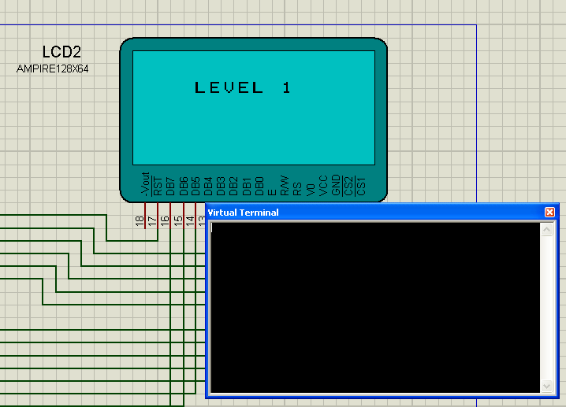

# sequence8086

  

 

## First things first
You must have [Proteus Design Suite](https://www.labcenter.com/) installed and make sure you have `MASM32` compiler plugin installed.

## What is its purpose?
As you probably know already, this program is executed in a simulated computer. I developed this for my assembly classes in college.

## Running it
You don't even need to understand assembly. Just open **`sequence8086`** Proteus executable and click in that nice button called "play". A terminal should pop up, which is where input data is received. All outputs are printed in the small display. That's it!

## License
Released under the [GPLv3](LICENSE) license.
